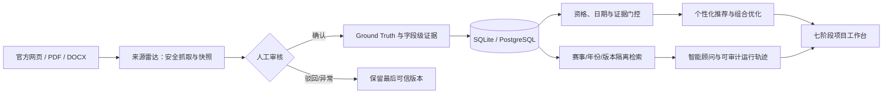

# 技术文档

> 本版指标、演示与边界以 [当前提交快照](../docs/SUBMISSION_STATUS.md) 为准。本目录仅保留当前参赛材料与验收报告。

## 1. 系统定位与技术路线

校园科创导航智能体把“赛事资料”转化为可执行的学生参赛闭环：用户画像输入后，系统完成资格与时间门控、解释型匹配、三种机会组合、七阶段项目推进、来源变化提醒与可追溯问答。关键事实不由大模型生成；Agent 只在同赛事、同年份的本地证据范围内组织回答，网络或模型不可用时自动回退确定性逻辑。

## 2. 模块说明

| 模块 | 实现 | 作用 |
| --- | --- | --- |
| 前端单页应用 | `frontend/` 原生 HTML/CSS/JavaScript | 首页、赛事大厅、匹配建议、行动路线、项目四视图、提醒与智能顾问 |
| API 与认证 | `src/api.py` | FastAPI 路由、HMAC 会话、资源所有权校验、健康检查 |
| 数据与证据 | `src/db.py`、`src/schemas.py`、`src/trust.py` | SQLite/PostgreSQL、201 条赛事目录（17 条关键证据完整）、字段级引用、可信门控 |
| 推荐与组合 | `src/recommendation/`、`src/portfolio/` | 资格/日期硬门控、能力匹配、周容量约束下的稳妥/均衡/冲刺路线 |
| 项目闭环 | `src/db.py`、前端项目页 | 加入赛事后生成资格核对→组队选题→报名→方案→制作→提交→答辩任务链 |
| 智能顾问 | `src/agent/`、`src/rag/` | 意图识别、年份消歧、隔离检索、来源引用、降级和运行轨迹 |
| 来源雷达 | `src/radar/` | HTTP/PDF/DOCX 规范化、SSRF 防护、快照差异、人工审核、用户提醒 |

## 3. 核心功能

1. **解释型赛事推荐**：先判断报名状态、学历和硬性资格，再输出匹配度、能力缺口和取舍。
2. **机会组合优化**：按可用时间、报名时间与能力目标生成三条可执行路线，不盲目堆叠赛事。
3. **项目执行闭环**：从推荐加入项目后自动生成任务、材料和依赖关系，支持列表、看板、日历、时间线和 ICS 导出。
4. **来源变化监控**：赛事事实不会因网页抓取变化自动改写；关键差异进入人工审核，异常来源保留真实状态。
5. **可信智能顾问**：问答给出赛事、能力缺口和取舍；无外网/无模型时回退本地知识库，不编造规则。

## 4. 运行环境与依赖

- Python 3.10+（已在 Python 3.13.14 环境验收）
- FastAPI、Uvicorn、Pydantic、SQLAlchemy、pdfplumber、python-docx、requests、cn2an、json-repair、jieba、rank-bm25、RapidFuzz
- 开发验证：pytest、Hypothesis；默认运行不需要安装开发依赖
- 默认 SQLite；可用 `DATABASE_URL` 切换 PostgreSQL
- 可选：OpenAI 兼容模型、Chroma、sentence-transformers；未配置时不影响核心功能

依赖清单见 `requirements.txt`，完整配置项见 [../README.md](../README.md) 与 [../docs/DEPLOYMENT.md](../docs/DEPLOYMENT.md)。

## 5. 部署方式

- 本地：Windows 执行 `start.ps1`；macOS/Linux 执行 `./start.sh`。
- 容器：`docker compose up --build`；`data/` 挂载为持久目录。
- 云端：本版没有自动部署蓝图，生产上线须另行配置与验收。
- 运行检查：`GET /health` 不暴露连接串或密钥；管理员写接口必须携带独立 `X-Admin-Token`。

完整架构、接口与数据边界见 [../docs/ARCHITECTURE.md](../docs/ARCHITECTURE.md)。

## v1.3 目标规划与安全补充

`src/agent/planner.py` 实现带状态的六工具流程，`GET /api/agent/ask?task_mode=true` 启用。自然语言约束通过开源 `cn2an` 识别中文数字，并由本地范围规则再次校验；模型返回的轻微JSON语法错误由 `json-repair` 修复，修复结果仍必须通过单字段结构和工具白名单。可用工具取决于已完成观察，最多六步、两次模型选择；模型只看到脱敏目标和公开聚合状态，不接收原始私密问题。白名单和参数校验失败则回退；资格、证据与组合仍由程序检查。每次记录可展示的动作与观察，不保存隐藏推理。对未知赛事、已截止、零容量、身份不符等情况停止或请求补充，不自动改写个人资料。

模型辅助规划只在设置 AGENT_LLM=1 时启用，当前提交以离线策略通过验收。组合收益与工作量为估计，不是获奖概率。用户确认画像后，在行动路线显式采用方案才能写项目。

## 开源组件增强与验证

默认证据检索接入 jieba 搜索分词与 rank-bm25 的 BM25Plus，替换原字符重叠排序；仍先按赛事 ID、年份和版本隔离，再返回未改写的原始 Citation。字段检索标签只参与排序，不作为官方原文。索引缓存包含原文和字段，数据修改后自动使用新索引。可选语义路径的词项信号也改为中文分词重叠。`GET /health` 的 `retrieval_backend` 标识实际检索机制。

RapidFuzz 对相差一个编辑操作的完整赛事名称或短杯赛品牌给出候选。候选不自动成为赛事事实：例如“蓝乔杯”提示“蓝桥杯”并要求确认完整名称和年份，不返回未确认赛事的截止日期或引用。已有正式名称、别名和明确 ID 的解析优先保留。

Hypothesis 仅用于开发测试，自动生成中英文数字约束、Unicode 查询、错误年份、JSON 类型和畸形模型输出，检查约束一致性、引用归属、年份隔离、返回数量与工具白名单。使用固定生成配置，禁用测试案例数据库，测试业务数据使用临时 SQLite。

新增 20 条开发者标注的检索排序对照：Top-1 从 18/20 到 19/20，Recall@3 从 19/20 到 20/20，覆盖两项赛事。该结果是小规模工程对照，不是独立准确率或真实学生效果。复现命令为 `python evals/run_retrieval_comparison.py`，详见 [检索架构及限制](../docs/RAG_ARCHITECTURE.md) 和 [开源声明](../docs/THIRD_PARTY_NOTICES.md)。大型模型、OCR 和额外服务未纳入默认依赖，尚无对照收益支持其部署成本。

`src/deployment_security.py` 在生产启动时检查独立高强度会话和管理员密钥、禁止调试入口及通配跨域，默认禁用演示登录。归档前执行模式扫描；生产凭据管理及访问控制由部署方另行验收。
