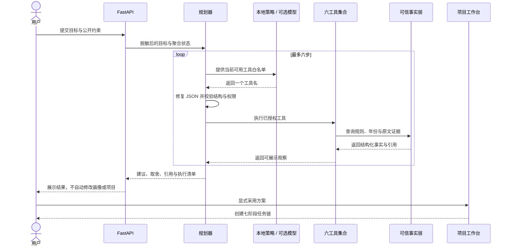
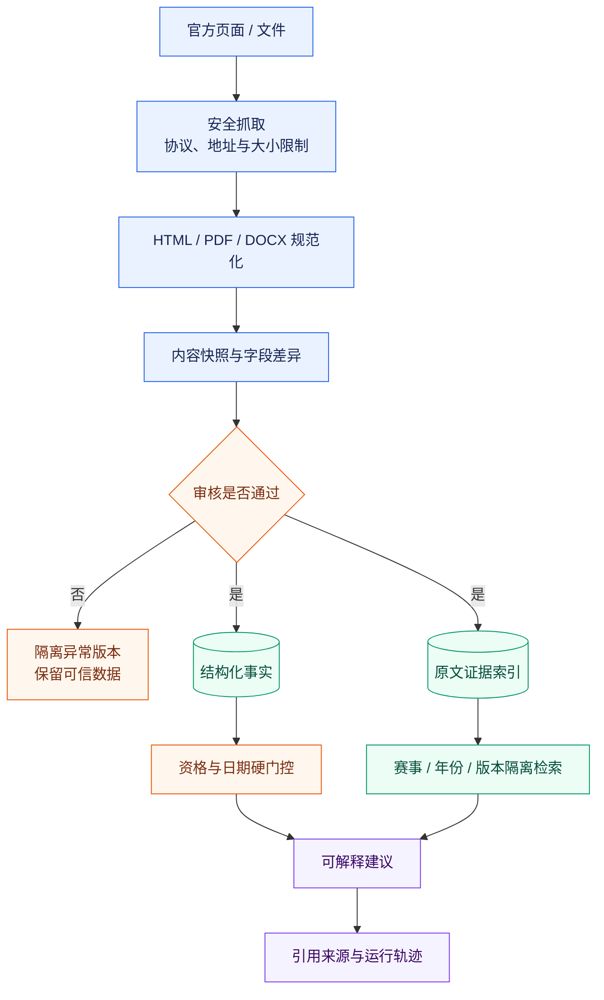
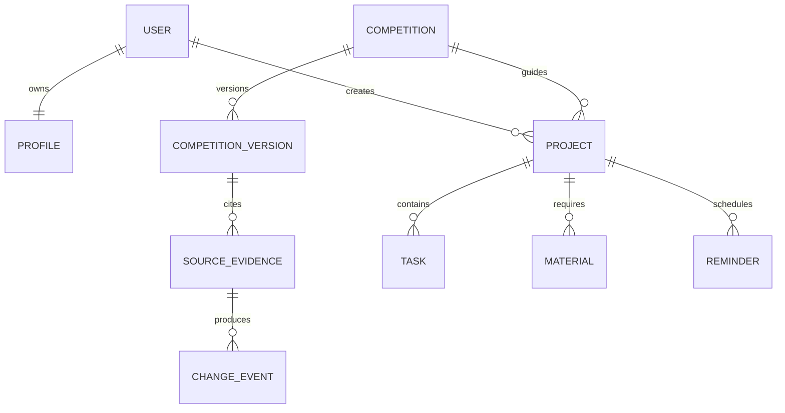

# 校园科创导航智能体｜技术白皮书

_中兴赛道 · 命题五「自主命题智能体」· v1.3 开源增强版 · 2026-10-10_

> **一句话定义**：面向计算机学院学生，把分散、易变的竞赛规则转化为有证据、可解释、能执行的科创决策与项目推进闭环。

重点服务编程、人工智能、数据分析、网络安全与软件创新方向，关注学生从算法与工程技能到参赛作品的转化。201条赛事目录包含跨专业通用赛事，是否适合某位学生仍由个人画像、官方资格和证据门控决定。

本文是 [材料总表](../SUBMISSION.md) 指定的参赛技术文档，对应仓库 `main` 分支的当前实现。指标以 [提交快照](../docs/SUBMISSION_STATUS.md) 为准；关键事实、工程验证与能力边界均提供仓库内可核验落点。

## 📋 评审摘要

校园竞赛服务的核心难点并非“再做一个赛事列表”，而是同时解决三类问题：规则散落且持续变化、推荐结果缺乏依据、学生获得建议后仍不知道下一步做什么。本项目以 **可信赛事事实层 + 受约束智能体 + 七阶段项目工作台** 组成完整链路。

| 评审维度 | 当前实现 | 可核验落点 |
| --- | --- | --- |
| 数据基础 | 201 条赛事记录；17 条关键证据完整；11 条在2026-10-04快照时仍可报名 | `data/`、`evals/submission_snapshot.json` |
| 智能决策 | 六工具规划、资格与日期硬门控、三种机会组合、离线降级 | `src/agent/`、`src/recommendation/`、`src/portfolio/` |
| 可信回答 | 同赛事/同年份/同版本隔离检索；原文引用；来源变化须人工审核 | `src/rag/`、`src/trust.py`、`src/radar/` |
| 执行闭环 | 七阶段任务链；列表、看板、日历、时间线；ICS 导出 | `src/api.py`、`frontend/` |
| 工程质量 | 182 项回归检查、26 个属性测试子项、8 项浏览器验收 | `submission/03_测试用例摘要.md`、`evals/` |
| 安全设计 | HMAC 会话、资源所有权校验、独立管理员令牌、SSRF 防护、生产配置门禁 | `src/deployment_security.py`、`src/api.py` |

项目当前采用 **本地可信计算优先、模型能力可选增强** 的技术路线。模型不可用时，资格判断、赛事匹配、组合优化、任务生成和证据检索仍可运行；模型启用后只负责受白名单约束的工具选择与自然语言组织，不直接生成赛事事实。

## 🏗️ 总体架构

系统按“来源—事实—决策—执行—反馈”分层。赛事规则先经过安全采集与人工审核，再进入可信事实层；所有推荐与问答都从该层取证，最终转化为项目任务和提醒。

```mermaid
flowchart LR
    accTitle: 校园科创导航智能体总体架构
    accDescr: 展示赛事来源经过安全采集、人工审核和可信数据层后，为推荐、智能顾问与项目执行提供依据的完整链路。

    subgraph source_layer[来源与治理]
        sources["官方网页 / PDF / DOCX"]
        radar["来源雷达<br/>抓取 · 快照 · 差异检测"]
        review{"人工审核"}
        retained["保留最后可信版本"]
        sources --> radar --> review
        review -->|异常或拒绝| retained
    end

    subgraph trust_layer[可信事实层]
        truth[("赛事事实与字段级证据")]
        isolation["赛事 / 年份 / 版本隔离"]
        review -->|确认| truth
        retained --> truth
        truth --> isolation
    end

    subgraph intelligence_layer[智能决策层]
        gates["资格 · 日期 · 证据硬门控"]
        retrieval["jieba + BM25Plus 检索"]
        agent["六工具受约束智能体"]
        portfolio["稳妥 / 均衡 / 冲刺组合"]
        isolation --> gates
        isolation --> retrieval
        gates --> agent
        retrieval --> agent
        agent --> portfolio
    end

    subgraph action_layer[学生执行层]
        workspace["七阶段项目工作台"]
        views["列表 · 看板 · 日历 · 时间线"]
        reminders["任务提醒 · ICS 导出"]
        portfolio --> workspace --> views
        workspace --> reminders
    end

    classDef source fill:#EAF2FF,stroke:#2563EB,color:#172554
    classDef trusted fill:#ECFDF5,stroke:#059669,color:#064E3B
    classDef intelligence fill:#F5F3FF,stroke:#7C3AED,color:#3B0764
    classDef action fill:#FFF7ED,stroke:#EA580C,color:#7C2D12
    class sources,radar,review,retained source
    class truth,isolation trusted
    class gates,retrieval,agent,portfolio intelligence
    class workspace,views,reminders action
```



| 层级 | 主要实现 | 设计目标 |
| --- | --- | --- |
| 交互层 | 原生 HTML/CSS/JavaScript 单页应用 | 降低部署复杂度，集中呈现推荐、问答与项目进度 |
| 服务层 | FastAPI、Pydantic、SQLAlchemy | 统一 API、输入校验、会话与资源权限 |
| 智能层 | 本地规则、六工具 Planner、可选 OpenAI 兼容模型 | 让模型参与规划，同时保留程序化约束与降级能力 |
| 检索层 | jieba、BM25Plus、可选语义检索 | 中文查询召回、字段级证据返回、版本隔离 |
| 数据层 | SQLite / PostgreSQL | 本地开箱即用，生产环境可切换关系型数据库 |
| 治理层 | 来源雷达、快照差异、人工审核 | 防止抓取结果未经确认直接覆盖可信事实 |

## 🧠 智能体执行机制

智能顾问不是开放式“自由行动”代理。系统根据已完成观察逐步释放工具，每轮最多执行六步，其中模型最多参与两次工具选择。任何模型结果都必须通过 JSON 修复、单字段结构校验、工具白名单和参数校验；失败时立即回退到确定性策略。

| 工具 | 作用 | 关键约束 |
| --- | --- | --- |
| `catalog_search` | 从目录中寻找候选赛事 | 只读取本地赛事范围，不写用户数据 |
| `verify_evidence` | 核对官方依据与报名状态 | 缺少关键证据时不形成确定性结论 |
| `check_eligibility` | 校验学历、身份、人数与日期 | 资格和截止时间采用硬门控 |
| `compare_opportunities` | 比较投入、缺口与取舍 | 输出解释，不声称获奖概率 |
| `optimize_portfolio` | 在周容量约束下组合赛事 | 给出稳妥、均衡、冲刺三类方案 |
| `build_checklist` | 生成带依据的行动清单 | 只有用户显式采用方案后才写入项目 |



模型只接收脱敏目标和公开聚合状态，不接收原始私密问题或完整个人画像。系统记录可展示的动作与观察，用于复核执行路径，不保存或展示隐藏推理。

## 🔐 可信数据与 RAG

本项目把“结构化判断”和“原文取证”分开：报名截止、适用对象、团队人数和材料要求由结构化字段支撑程序判断；面向用户的解释从原始片段中检索并附上来源。检索排序不会改写 Citation 原文。



默认检索后端使用 jieba 搜索分词与 `rank-bm25` 的 BM25Plus。RapidFuzz 只对近似赛事名称提出候选，例如输入“蓝乔杯”时提示“蓝桥杯”并要求确认；候选不会自动升级为赛事事实，也不会返回未确认赛事的日期或引用。可选 Chroma 与语义模型未列为核心运行依赖。

## 🗃️ 数据与执行闭环

### 数据来源与实际使用边界

本系统的数据分为保存的官方赛事资料、用户主动填写的业务资料、提供者确认来源的试用记录，以及预置测试画像和工程夹具。官方资料用于赛事事实判断；试用记录用于描述限定样本的任务表现；测试画像和合成夹具用于功能体验与边界验证，不作为实际学生身份、官方通知或落地收益证据。完整分类见 [数据来源与证据边界](../docs/DATA_PROVENANCE.md)。

当前队友候选只取自预置测试画像，尚不能宣称已实现真实学生招募。雷达既支持实际来源抓取，也保留管理员的人工通知演练入口；演练可进入快照和审核流程，不证明官网发生更新。本轮仅修订说明，未改代码或完成演练通道隔离。

### 项目执行

加入赛事后，系统将推荐结果转化为项目，而不是停留在一段建议文本。项目包含任务、材料、提醒和变更记录，并通过用户所有权约束访问范围。



标准项目链包含七个阶段：

1. **资格核对**：确认对象、身份、赛区、人数与截止日期。
2. **组队选题**：拆解能力缺口、队伍角色与题目方向。
3. **报名准备**：形成报名信息和材料清单。
4. **方案设计**：确定目标、技术路线、里程碑和验收标准。
5. **作品制作**：围绕关键交付物推进实现与迭代。
6. **提交检查**：核对格式、文件、链接、署名和截止时间。
7. **答辩准备**：沉淀演示、讲稿、问答与风险预案。

同一任务可在列表、看板、日历和时间线四种视图中呈现，并可导出 ICS 日程。画像确认与方案采用均需要用户显式操作，智能体不会自动改写个人资料或替用户报名。

## 🛡️ 安全与合规

| 风险面 | 当前控制 |
| --- | --- |
| 会话伪造 | HMAC 签名用户会话；生产环境要求独立高强度密钥 |
| 越权访问 | 项目、任务和材料执行 owner 校验；管理员写操作使用独立 `X-Admin-Token` |
| 恶意来源 | 来源雷达限制协议、地址、重定向与响应大小，阻断本地地址和常见 SSRF 路径 |
| 模型越权 | 工具白名单、参数校验、最大步数与选择次数限制；失败时回退本地策略 |
| 敏感信息外传 | 模型输入仅含脱敏目标和公开聚合状态，不传原始私密问题与完整画像 |
| 错误事实写入 | 抓取变化先进入审核，未经确认不覆盖可信版本 |
| 生产误配置 | 启动时检查弱密钥、调试入口、通配跨域与演示登录 |
| 凭据泄露 | 归档前执行模式扫描；提交仓库不承载生产数据库和真实凭据 |

`GET /health` 只暴露运行状态与实际检索后端，不返回连接串或密钥。线上凭据轮换、网络边界、访问审计与备份策略仍由部署环境负责验收。

## 📊 验证与实测

下表来自 2026-10-04 的冻结提交快照，目标是给评委一组可复现、不过度外推的工程证据。

工程检查会使用合成边界夹具、预置测试画像和自动生成问句；输入来源不因为测试实际运行而变成官方资料或学生试用记录。工程通过率与后面的用户任务成功率分别报告。

| 验证项 | 结果 | 说明 |
| --- | ---: | --- |
| 正式验收 | 15 / 15 | 覆盖材料、数据、接口与关键流程 |
| 回归检查 | 182 项通过 | 覆盖推荐、RAG、项目闭环、安全与兼容行为 |
| 属性测试 | 26 个子项通过 | 随机覆盖中英文数字、Unicode、年份隔离、畸形模型输出等 |
| 数据模板 | 806 / 806 | 模板与字段检查通过 |
| 浏览器验收 | 8 / 8 | 关键前端路径通过 |

20 条开发者标注查询的检索对照如下。该结果用于验证排序改造方向，只代表小规模工程样本，不等同于独立准确率、真实用户效果或获奖概率。

| 检索方案 | Top-1 | Recall@3 | MRR |
| --- | ---: | ---: | ---: |
| 基线字符重叠 | 18 / 20 | 19 / 20 | 0.9292 |
| jieba + BM25Plus | **19 / 20** | **20 / 20** | **0.9667** |

复现入口：

```bash
python evals/run_retrieval_comparison.py
python scripts/check_submission_materials.py --video demo/演示视频.mp4 --require-video
pytest -q
```

更完整的测试口径见 [测试用例摘要](03_测试用例摘要.md) 和 [提交快照](../docs/SUBMISSION_STATUS.md)。

### 用户提供的试用记录分析

本节与工程验收分开。团队报告的统计冻结日期2026-10-07，材料修复日期2026-10-10。用户确认参与者全部来自计算机学院；本轮从公开报告转录聚合JSON并核对算术，原始工作簿未提供，未完成身份、原始凭证、日期、被试用版本及排除依据的独立核验。

| 分析项 | 当前记录结果 | 解释边界 |
| --- | --- | --- |
| 样本 | 团队报告纳入190名计算机学院学生，完整问卷170份 | 学院归属由用户确认，不代表全部学院学生 |
| 推荐 | 基线36.8%（57/155）；保留样本60.0%（57/95） | 移除60条失败；含协助，排除理由未核验 |
| 机会组合 | 基线24.2%（31/128）；保留样本59.6%（31/52） | 移除76条未成功；含协助，排除理由未核验 |
| 推荐评价 | 团队报告329条，均分3.26/5；联合条件通过111/329 | 从公开报告转录，未独立重访官网 |
| 用户体验 | 总体满意3.31/5；行动明确3.04/5 | 170份完整问卷，不转换成满意人数比例 |
| 配对效率 | 76组，平均少耗时45.8秒；16组系统更慢 | 双方独立成功子集，不外推到全部任务 |
| 反馈 | 560条，推荐138条、组合152条 | 表内未处理、未复测，不称已形成修复闭环 |

任务、公式、问卷、反馈及限制见 [用户试用报告](../docs/USER_STUDY.md)，样本筛选与基线说明见 [数据来源与证据边界](../docs/DATA_PROVENANCE.md)，聚合结果见 [统计附件](../evals/user_study_results.json)，文件入口见 [证据索引](../evidence/user_study/README.md)。聚合材料不包含个人原始行，不代替知情同意和凭证复核。

## 🚀 运行与部署

### 本地启动

**Windows**

```powershell
.\start.ps1
```

**macOS / Linux**

```bash
./start.sh
```

启动后访问终端显示的本地地址。默认使用 SQLite，核心功能不要求外网、模型账号或额外向量服务。

### 容器启动

```bash
docker compose up --build
```

`data/` 作为持久目录挂载；设置 `DATABASE_URL` 可切换 PostgreSQL。模型增强通过 `AGENT_LLM=1` 和 OpenAI 兼容配置显式启用，未配置时自动使用离线策略。

### 生产门槛

当前仓库提供可运行参赛版本，不包含一键云端生产发布。正式部署前至少应完成：独立高强度密钥配置、管理员令牌配置、限定 CORS 来源、关闭演示登录、外部数据库与备份验证、反向代理 TLS、访问控制和日志审计。完整清单见 [部署文档](../docs/DEPLOYMENT.md)。

## 🔌 关键接口

| 接口 | 用途 | 备注 |
| --- | --- | --- |
| `GET /health` | 健康检查与检索后端标识 | 不返回密钥或连接串 |
| `GET /api/agent/ask?task_mode=true` | 启用带状态的六工具规划 | 支持离线回退 |
| 推荐与组合相关接口 | 资格门控、匹配解释与机会组合 | 以程序规则约束关键判断 |
| 项目相关接口 | 创建项目、任务、材料与提醒 | 强制资源所有权校验 |
| 来源雷达管理接口 | 抓取、差异审阅与可信版本更新 | 写操作要求管理员令牌 |

接口细节与数据边界见 [架构文档](../docs/ARCHITECTURE.md)；检索实现见 [RAG 架构及限制](../docs/RAG_ARCHITECTURE.md)。

---

**评审导航**：[可运行作品说明](01_可运行作品说明.md) · [测试用例摘要](03_测试用例摘要.md) · [演示视频](../demo/演示视频.mp4) · [完整 README](../README.md) · [开源声明](../docs/THIRD_PARTY_NOTICES.md)
